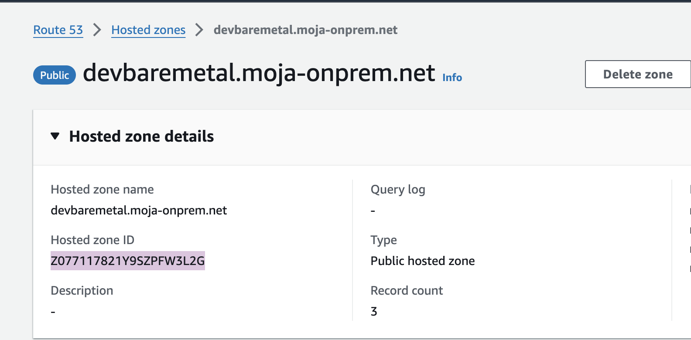

# Cluster Provisioning

1.  Prerequisites\
    At this stage it is required that the Control Center must run in AWS
    Cloud

    a.  AWS account

    b.  Domain purchase in AWS Router53

    c.  Terraform version 1.6.6

2.  Configuring required resources in AWS

    a.  Provisioning the required on-prem hosted zones under the
        selected domain.\
        For instance following hosted zones:\
        devbaremetal.domainName\
        dev1.devbaremetal.domainName

    b.  Create the records in AWS Route53 \
        i.  Create a new hosted zone: \
        *devbaremetal.\<domain name\>

        ii. Copy the ns records from the new hosted zone

        iii. Create a NS record named *devbaremetal.\<domain name\>* in
             the parent domain *\<domain name\>* with the ns records
             gather from above point (ii)

        iv. Create a new hosted zone: *dev1.devbaremetal.\<domain
            name\>*

        v.  Copy the ns records from the new hosted zone

        vi. Create a new NS record named *dev1.devbaremetal.\<domain
            name\>* in the parent domain *devbaremetal.\<domain name\>*
            with the ns records gather from above point (v)

    c.  Create AWS group with Admin rights enabled adding the policy
        *AdministratorAccess* to that group

3.  Configuring existing domain and generating ssh keys

    a.  Reconfiguring the domain is required only if you are using an
        existing domain, however the recommendation is to use a new
        domain name on test phase \
        i. Obtain the public zone id from AWS console Route53 from the correspondig domain or subdomain name \
        
        ii. Populate the file variables.tf accordingly. \
        If your existing domain name is domain.com then in the previous step you must create accordingly the hosted zones devbaremetal.domain.com and dev1.devbaremetal.domain.com \
        Therefore you must populate the variables:\
        domain with *devbaremetal.domain.com\
        Public_zone_id with public zone id obtained above

iii. Run terraform apply the prompt for confirmation must be something
     as follows

```{=html}
<!-- -->
```
4.  VM provisioning

    a.  Provision as minimum the following vms with corresponding
        minimum specifications

        i.  3 x Master nodes: 4 cpu, 8 Gi memory and 100 Gi disk

        ii. 3 x Worker nodes: 16 cpu, 32 Gi memory and 250 Gi disk

        iii. 1 x HAproxy: 4 cpu, 8 Gi memory and 100 Gi disk, 2 x NIC

        iv. 1 x Bastion: 4 cpu, 8 Gi memory and 100 Gi disk

    b.  Operation System

        i.  Install ubuntu server 22.04.3

        ii. Disable unmanaged automated updates

        iii. Set journalctl to keep only 1 day
