# Control Center and Cluster Provisioning

1. Prerequisites

    a. AWS Account

    b. Purchase Domain in AWS Route53

    c. Tools installed
    1. Terraform version 1.6.6
    2. Ansible
    3. AWS cli
    4. Docker

    d. Configuring AWS Resources
    1. Creating the hosted zones under selected domain.
    For the purpose of this document let use the following sample names:
        
        `devbaremetal.domainName`

        `dev1.devbaremetal.domainName`
        
        a. Create the records in AWS Route53
            
        i. Create a new hosted zone: `devbaremetal.domainNname`
        
        ii. Copy the ns records from the new hosted zone
        
        iii. Create a NS record named `devbaremetal.domainNname` in the parent domain `domainNname` ith the ns records gathered from above point (ii)
        
        iv. Create a new hosted zone: `dev1.devbaremetal.domainNname`
        
        v. Copy the ns records from the new hosted zone
        
        vi. Create a new NS record named `dev1.devbaremetal.domainName` in the parent domain `devbaremetal.domainName` with the ns records gathered from above point (v)
    
    2. Create AWS group with Admin rights enabled adding the policy
        `AdministratorAccess` to that group

    3. Configuring existing domain and generating ssh keys.
        Reconfiguring the domain is required only if you are using an existing domain, however the recommendation is to use a new domain name on test phase
        
        a. Clone the repo and move to the folder `postconfigk8s`
        
        b. Obtain the public zone id from AWS console Route53 from the correspondig domain or subdomain name.
        
        c. Populate the file `variables.tf` accordingly. If your existing domain name is domain.com then in the previous step you must create accordingly the hosted zones `devbaremetal.domain.com` and `dev1.devbaremetal.domain.com`.
        Therefore you must populate the variables:
        >    1. Domain with `devbaremetal.domain.com`
        >    2. Public_zone_id with public zone id obtained above, only as sample: `207711782...L2G`
        
        d. Run terraform apply the prompt for confirmation
        
        e. Copy the private and public ssh key in a secure place, you will need later

    4. Provisioning and Configuring on-prem vms

        a. Required VM

        1. Master nodes: 3 vms having 4 cpu, 8 Gi RAM and 100 Gi Disk
        2. Worker nodes: 3 vms having 16 CPU, 32 Gi RAM and 250 Gi Disk
        3. HAProxy node: 1 vm having 4 cpu, 8 Gi RAM and 60 Gi Disk, 2 network interfaces
        4. Bastion node: 1 vm having 4 cpu, 8 Gi RAM and 60 Gi Disk
    
        b. Configuring the VM
    
        1. Obtaining the public ssh key in the case you did not store
        run the following command in the same folder: `terraform output ssh_private_key`
        2. Add the above public ssh key on each vm in the file: `~/.ssh/authorized_keys`
        3. Configure sshd enabling `PubkeyAuthentication yes` and disabling `PasswordAuthentication no`. Path: `/etc/ssh/sshd_config`
        4. Configure the vm user as sudoer running the following command:
        `echo "<userName>  ALL=(ALL) NOPASSWD:ALL" | sudo tee /etc/sudoers.d/<userName>` \
        Replace `<userName>` with the actual username you are using
        5. Disable unattended upgrades running the following command: \
        `dpkg-reconfigure unattended-upgrades`
        
        c. Configuring the HAproxy
        1. Install haproxy running the following command:
        `sudo apt install haproxy`
        2. Use the file as template
        [HAproxy Config](assets/haproxy.cfg "haproxy.cfg")
        3. Restart the haproxy service running the following command:
        `sudo systemctl restart haproxy`

    5. Configuring DNS

        a. DHCP names must be registered in DNS
        
        b. Enable DNS Forwarder
        
        c. Be sure your DNS configuration allows to resolve by hostName because that is required for microK8S, like WINs becuase if the DNS resolves hostName.localDomain you will need to add the corresponding ip and hostName in all the vms in the following file: `/etc/hosts`

    6. Configuring Firewall.

       The following configuration is done for pfsense firewal but pretty much standard topics.

       a. Enable NAT Reflection

        Follow the instruction in the link
       `https://docs.netgate.com/pfsense/en/latest/nat/reflection.html`

       b. Configure NAT Port Forward

       1. Before to port forward ssh to the bastion host please be sure strong password is in place but also double check the sshd is configured `PubkeyAuthentication yes` and disabling `PasswordAuthentication no`.
       2. Configure following port forward
       
           a.  ssh to bastion host
       
           b.  http and https to haproxy external named NIC
           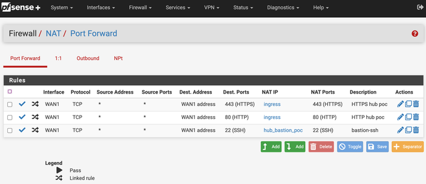

           c. Disable DNS Rebinding Checks in `SystemAdvancedAdmin Access` in order that DNS Forwared is not being block.

2. Provisioning Control Center

    a. Prerequisites

    1. Tools: Docker
    2. AWS credentials must be set in your local (no aws-vault or similar config is supported)
    3. Double check the AWS Group required in previous steps is created and Admin rights granted
    4. Clone the repo using following command:
        `git clone git@github.com:mojaloop/control-center-util.git`
    5. Change directory to folder `control-center-util`
    6. Run the docker images locally as follows

       Replace `<AWS credential full path>` for the local path where you configured the aws credentials, usually `~/.aws/credentials`

       The following will run a local container with all the tools you need to provision the Control Center

       `docker run -it -v <AWS credential full path>:/root/.aws http://ghcr.io/mojaloop/control-center-util:0.9.4  /bin/bash`

    7. In the container change directory to iac-run-dir and your are ready to start: 
    
       `root@99b77fc9e79e:/# cd iac-run-dir/`

    8. Review the environment variables running the command: `cat setenv`. The `IAC_TERRAFORM_MODULES_TAG` must the the stable one.
    The output must be something as follows:

            root@99b77fc9e79e:/iac-run-dir# cat setenv
            export AWS_PROFILE=oss
            export PRIVATE_REPO_TOKEN=nullvalue
            export PRIVATE_REPO_USER=nullvalue
            export ANSIBLE_BASE_OUTPUT_DIR=$PWD/output
            export IAC_TERRAFORM_MODULES_TAG=v0.37.0
            export PRIVATE_REPO=example.com

    9. Initialize the env running the following command:

       `./init.sh`

       The the expected result must look as follow:

            Cloning into 'iac-modules'...
            remote: Enumerating objects: 5944, done.
            remote: Counting objects: 100% (965/965), done.
            remote: Compressing objects: 100% (213/213), done.
            remote: Total 5944 (delta 789), reused 832 (delta 739), pack-reused 4979
            Receiving objects: 100% (5944/5944), 793.63 KiB | 4.09 MiB/s, done.
            Resolving deltas: 100% (4031/4031), done.
            Your branch is up to date with 'origin/main'.

    b. Provisioning the Control Center

    1. Configuring the specific variables

        Change directory to the following folder:

        `cd iac-modules/terraform/control-center/init/`

        Content must looks like:

            root@33b2107bdf35:/iac-run-dir/iac-modules/terraform/control-center/init# ll
            total 72
            drwxr-xr-x 7 root root 4096 Nov 20 19:06 ./
            drwxr-xr-x 3 root root 4096 Nov 20 18:45 ../
            drwxr-xr-x 3 root root 4096 Nov 20 22:14 ansible-cc-deploy/
            drwxr-xr-x 3 root root 4096 Nov 20 22:14 ansible-cc-post-deploy/
            -rw-r--r-- 1 root root   72 Nov 20 18:45 aws-vars.yaml
            -rw-r--r-- 1 root root  122 Nov 20 18:45 common-vars.yaml
            drwxr-xr-x 3 root root 4096 Nov 20 22:14 control-center-deploy/
            drwxr-xr-x 3 root root 4096 Nov 20 19:04 control-center-post-config/
            drwxr-xr-x 3 root root 4096 Nov 20 22:14 control-center-pre-config/
            -rwxr-xr-x 1 root root  137 Nov 20 18:45 deleteAll.sh*
            -rwxr-xr-x 1 root root  105 Nov 20 18:45 destroyccinfra.sh*
            -rw-r--r-- 1 root root 1368 Nov 20 19:02 environment.yaml
            -rwxr-xr-x 1 root root 1551 Nov 20 18:45 movestatefromgitlab.sh*
            -rwxr-xr-x 1 root root 2945 Nov 20 18:45 movestatetogitlab.sh*
            -rwxr-xr-x 1 root root  284 Nov 20 18:45 run.sh*
            -rwxr-xr-x 1 root root  130 Nov 20 18:45 runall.sh*
            -rw-r--r-- 1 root root   92 Nov 20 18:45 setlocalenv.sh
            -rw-r--r-- 1 root root  437 Nov 20 22:14 terragrunt.hcl

        In the file `environment.yaml` please input the corresponding values to

            a. a. cloud_region
            b. domain must be the domain you are going to use in the on-prem env
            c. letsencrypt_email must the the registran email
            d. ansible_collection_tag current estable version v0.16.11
            e. iac_terraform_modules_tag current estable version v0.37.0

        The updated `environment.yaml` file must look as follow:

            region: eu-west-1
            domain: moja-onprem.net
            tenant: ctrlcenter
            enable_github_oauth: false
            enable_netmaker_oidc: true
            ansible_collection_tag: v0.16.11
            gitlab_admin_rbac_group: tenant-admins
            gitlab_readonly_rbac_group: tenant-viewers
            smtp_server_enable: false
            gitlab_version: 16.0.5
            gitlab_runner_version: 16.0.2
            iac_group_name: moja-onprem
            netmaker_version: 0.18.7
            letsencrypt_email: jbush@mojaloop.io
            delete_storage_on_term: true
            envs:
            - env: dev
                domain: labs.moja-onprem.net
                cloud_platform: aws
                managed_svc_cloud_platform: aws
                cloud_platform_client_secret_name: AWS_SECRET_ACCESS_KEY
                k8s_cluster_module: base-k8s
                cloud_region: eu-west-1
                k8s_cluster_type: microk8s
                ansible_collection_tag: v0.16.11
                iac_terraform_modules_tag: v0.30.4
                enable_vault_oauth_to_gitlab: true
                enable_grafana_oauth_to_gitlab: true
                letsencrypt_email: test@mojalabs.io
                dns_zone_force_destroy: true
                longhorn_backup_object_store_destroy: true
                agent_instance_type: "m5.2xlarge"
                master_instance_type: "m5.4xlarge"
                master_node_count: 3
                agent_node_count: 0
                vpc_cidr: "10.106.0.0/23"
                enable_k6s_test_harness: false
                k6s_docker_server_instance_type: "m5.2xlarge"
            tags:
            {
                "Origin": "Terraform",
                "mojaloop/cost_center": "mlf-iac-sandbox",
                "mojaloop/env": "ft-sbox-rw",
                "mojaloop/owner": "James-Bush",
            }

    2. Set enviromenta variables

       Run the following command:

       `source ./setlocalenv.sh`

    3. Performing the Control Center Provioning

       Command:

       `./runall.sh`

       Expected result is as the following:

            INFO[0000] The stack at /iac-run-dir/iac-modules/terraform/control-center/init will be processed in the following order for command init:
            Group 1
            - Module /iac-run-dir/iac-modules/terraform/control-center/init/control-center-deploy
            ...
            Group 5
            - Module /iac-run-dir/iac-modules/terraform/control-center/init/control-center-post-config
            
            Initializing modules...
            ...
            ...
            Apply complete! Resources: 21 added, 0 changed, 0 destroyed.

            Outputs:

            bootstrap_project_id = "1"
            docker_hosts_var_maps = <sensitive>
            iac_group_id = "5"
            netmaker_hosts_var_maps = <sensitive>

            Initializing the backend...

            Initializing provider plugins...
            - Reusing previous version of hashicorp/time from the dependency lock file
            - Reusing previous version of hashicorp/null from the dependency lock file
            ...
            Terraform has been successfully initialized!

            You may now begin working with Terraform. Try running "terraform plan" to see
            any changes that are required for your infrastructure. All Terraform commands
            should now work.

            If you ever set or change modules or backend configuration for Terraform,
            rerun this command to reinitialize your working directory. If you forget, other
            commands will detect it and remind you to do so if necessary.

            Terraform used the selected providers to generate the following execution
            plan. Resource actions are indicated with the following symbols:
            + create
            <= read (data resources)

            Terraform will perform the following actions:

            # data.gitlab_project_variable.vault_root_token will be read during apply
            # (depends on a resource or a module with changes pending)
            <= data "gitlab_project_variable" "vault_root_token" {
                + environment_scope = (known after apply)
                + id                = (known after apply)
                + key               = "VAULT_ROOT_TOKEN"
                + masked            = (known after apply)
                + project           = "1"
                + protected         = (known after apply)
                + raw               = (known after apply)
                + value             = (known after apply)
                + variable_type     = (known after apply)
                }

            # data.local_sensitive_file.netmaker_keys will be read during apply
            # (depends on a resource or a module with changes pending)
            <= data "local_sensitive_file" "netmaker_keys" {
                + content              = (sensitive value)
                + content_base64       = (sensitive value)
                + content_base64sha256 = (known after apply)
                + content_base64sha512 = (known after apply)
                + content_md5          = (known after apply)
                + content_sha1         = (known after apply)
                + content_sha256       = (known after apply)
                + content_sha512       = (known after apply)
                + filename             = "/iac-run-dir/output/control-center-post-config/keylist.json"
                + id                   = (known after apply)
                }

            # local_sensitive_file.ansible_inventory will be created
            + resource "local_sensitive_file" "ansible_inventory" {
                + content              = (sensitive value)
                + content_base64sha256 = (known after apply)
                + content_base64sha512 = (known after apply)
                + content_md5          = (known after apply)
                + content_sha1         = (known after apply)
                + content_sha256       = (known after apply)
                + content_sha512       = (known after apply)
                + directory_permission = "0700"
                + file_permission      = "0600"
                + filename             = "/iac-run-dir/output/control-center-post-config/inventory"
                + id                   = (known after apply)
                }

            # local_sensitive_file.ec2_ssh_key will be created
            + resource "local_sensitive_file" "ec2_ssh_key" {
                + content              = (sensitive value)
                + content_base64sha256 = (known after apply)
                + content_base64sha512 = (known after apply)
                + content_md5          = (known after apply)
                + content_sha1         = (known after apply)
                + content_sha256       = (known after apply)
                + content_sha512       = (known after apply)
                + directory_permission = "0700"
                + file_permission      = "0600"
                + filename             = "/iac-run-dir/output/control-center-post-config/sshkey"
                + id                   = (known after apply)
                }

            # null_resource.run_ansible will be created
            + resource "null_resource" "run_ansible" {
                + id       = (known after apply)
                + triggers = {
                    + "ansible_collection_tag" = "v0.16.11"
                    + "inventory_file_sha_hex" = (known after apply)
                    }
                }

            # time_sleep.wait_vault_var will be created
            + resource "time_sleep" "wait_vault_var" {
                + create_duration = "90s"
                + id              = (known after apply)
                }

            Plan: 4 to add, 0 to change, 0 to destroy.
            ...

            [id=1:VAULT_ROOT_TOKEN:]

            Apply complete! Resources: 4 added, 0 changed, 0 destroyed.

            Outputs:

            netmaker_control_network_name = "cntrlctr"
            netmaker_token_map = <sensitive>
            vault_root_token = <sensitive>
    4. If no error in the previous step, we are good to move the local Terraform State to brand new GitLab instance provisioned

       Command:

       `./movestatetogitlab.sh`

       Output:

            root@33b2107bdf35:/iac-run-dir/iac-modules/terraform/control-center/init# ./movestatetogitlab.sh
            INFO[0000] The stack at /iac-run-dir/iac-modules/terraform/control-center/init will be processed in the following order for command init:
            Group 1
            - Module /iac-run-dir/iac-modules/terraform/control-center/init/control-center-deploy
            ...
            Group 5
            - Module /iac-run-dir/iac-modules/terraform/control-center/init/control-center-post-config
            
            Initializing modules...
            ...
            Initializing provider plugins...
            - Reusing previous version of hashicorp/random from the dependency lock file
            - Reusing previous version of hashicorp/tls from the dependency lock file
            ...
            - Using previously-installed cloudposse/awsutils v0.18.1

            Terraform has been successfully initialized!
            ...
            create mode 100644 terragrunt.hcl
            Enumerating objects: 24, done.
            Counting objects: 100% (24/24), done.
            Delta compression using up to 16 threads
            Compressing objects: 100% (16/16), done.
            Writing objects: 100% (23/23), 7.66 KiB | 1.53 MiB/s, done.
            Total 23 (delta 4), reused 0 (delta 0)
            To https://gitlab.ctrlcenter.moja-onprem.net/iac/bootstrap.git
            926ad2f..960b088  main -> main
        
        You will see the gitlab URL at the end of the above output: 
        
        `https://gitlab.ctrlcenter.moja-onprem.net/iac/bootstrap.git`

    5. Login in the Control Center GitLab instance as first time

        a. Getting the GitLab root password:

        Command:

        `yq eval '.gitlab.vars.server_password' $ANSIBLE_BASE_OUTPUT_DIR/control-center-deploy/inventory`

        Output:
            
           bASmLqAajh37aXqg

        b. Login GitLab as root using the above captured URL `https://gitlab.ctrlcenter.moja-onprem.net/iac/bootstrap.git`
        
        The first login will prompt you to enable MFA, because this is a mandatory task plese use your favorite Authenticator App to scan the QR and get MFA enabled
        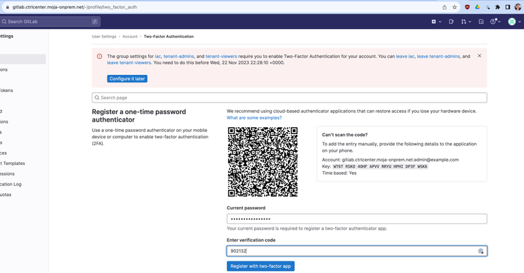

        Please do not forget to stoere in secure place your recovery code.

        c. Create your personal admin account

        1. Go to Admin -> Users menu
        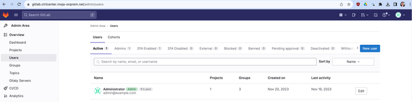
        2. Input the user information in the form
        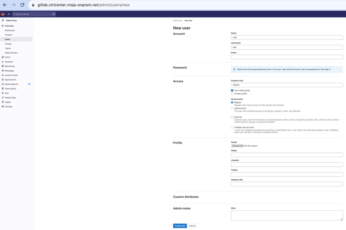

        3. After saving you should receive and email in your inbox, if not check also spam folder

        4. If the case is that you did not recieve the email please assign a temporary password to loging at first time

        5. Add the user to the following groups

                tenant-viewers
                iac
                tenant-admins
    6. Configuring NetMaker

       a. Obtaining the NetMaker url:

        Command:

        `yq eval '.netmaker.vars.netmaker_base_domain' /iac-run-dir/output/control-center-post-config/inventory`

        Output:
            
           netmaker.ctrlcenter.moja-onprem.net

        Then the NetMaker URL is as follows:

            dashboard.netmaker.ctrlcenter.moja-onprem.net

       b. Getting the NetMaker `nmaker-admin` password:

        Command:

        `yq eval '.netmaker.vars.netmaker_admin_password' /iac-run-dir/output/control-center-post-config/inventory`

        Output:
            
           TjO2WpwK89eKRJxxxxxxT4ztfAGHGx

       c. Login from your browser, the login pages must look like following
       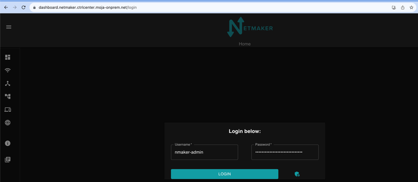

          Landing page must look like following after login
          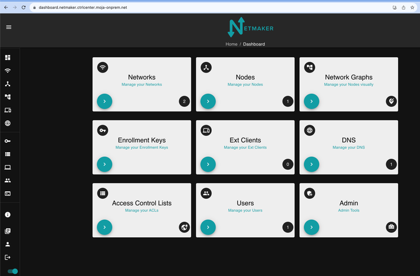

       d. Configure the Node

       1. Move to the Nodes Menu, you will see the first preconfigured node named in this case `cntrlctr`
       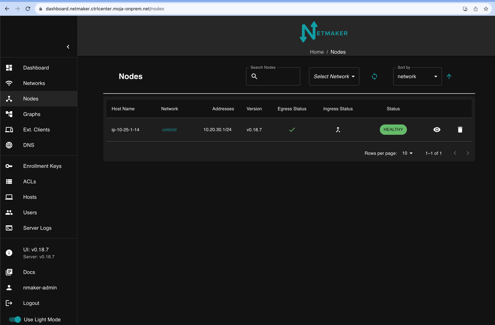
       2. Next step is to creating the Ingress Gateway in the node, clicking in the Ingress Gateway empty icon and Accept
       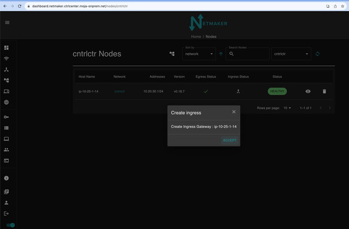
       The node after the Ingress Gateway is successfully created looks like follows:
       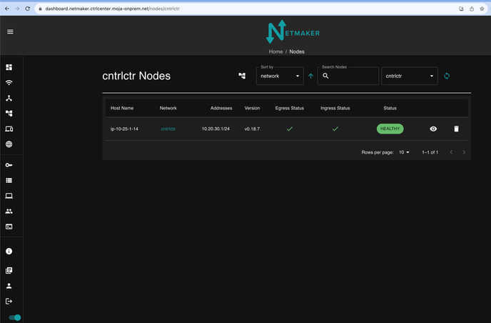
       3. Adding new External Client clicking in Add External Client after to select Ext. Clients in the side menu. Also known as WireGuard VPN clients/profiles
       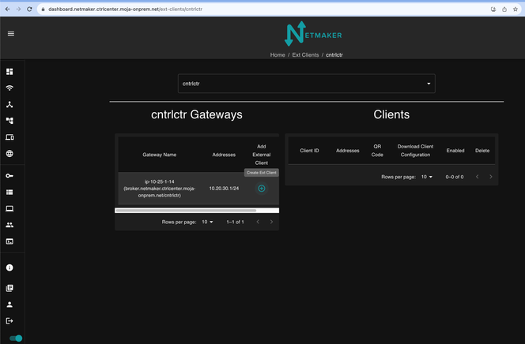
       Once the new external client is created you can rename and then get the vpn profile
       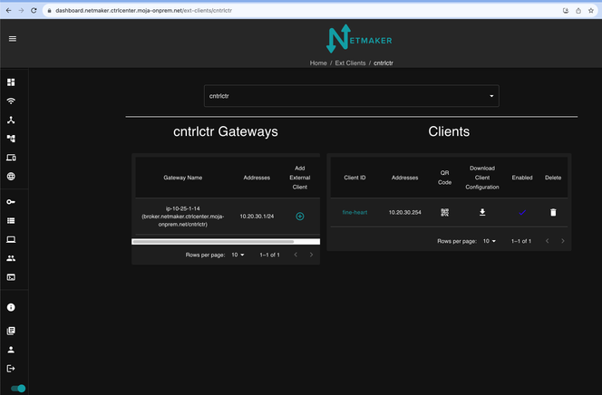
   
   7. Generating the Environment GitLab Repo
      > [!WARNING] Please note if you run the job deploy-env-templates ALL the existing repos will be reset to the initial values, therefore you will need to update the files using the gitlab history

      a. In gitlab bootstrap repo file name `enviroment.yaml` be sure to input the corresponding values in the directive `- envs`

      That section must look like:

            envs:
            - env: dev1
                domain: devbaremetal.moja-onprem.net
                cloud_platform: bare-metal
                managed_svc_cloud_platform: none
                cloud_platform_client_secret_name: none
                k8s_cluster_module: base-k8s
                cloud_region: eu-west-1
                k8s_cluster_type: microk8s
                ansible_collection_tag: v0.16.11
                iac_terraform_modules_tag: v0.37.0
                enable_vault_oauth_to_gitlab: true
                enable_grafana_oauth_to_gitlab: true
                letsencrypt_email: oscar.cobar@infitx.com
                dns_zone_force_destroy: true
                longhorn_backup_object_store_destroy: true
                agent_instance_type: "m5.2xlarge"
                master_instance_type: "m5.4xlarge"
                master_node_count: 3
                agent_node_count: 0
                vpc_cidr: "10.106.0.0/23"
                enable_k6s_test_harness: false
                k6s_docker_server_instance_type: "m5.2xlarge"

        b. After to commit an push the changes new pipleline will be created, please wait until the `init` job successfully finish, then run the job `deploy`, like the following
        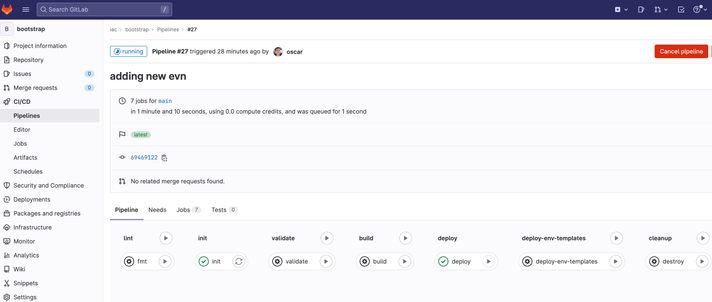

        c. Then once job `deploy` successfully done run `deploy-env-templates` job, that will create a new Project name `iac/dev1`
        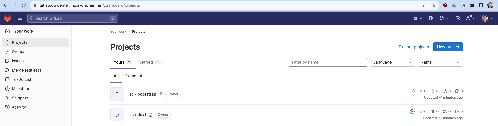
