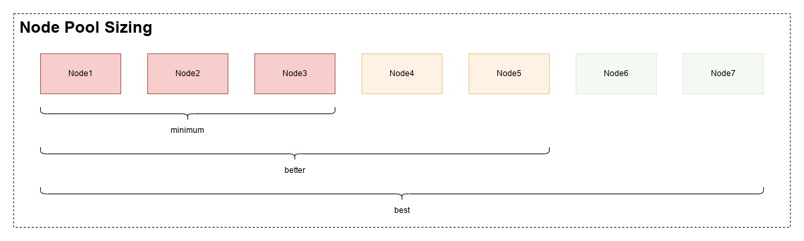
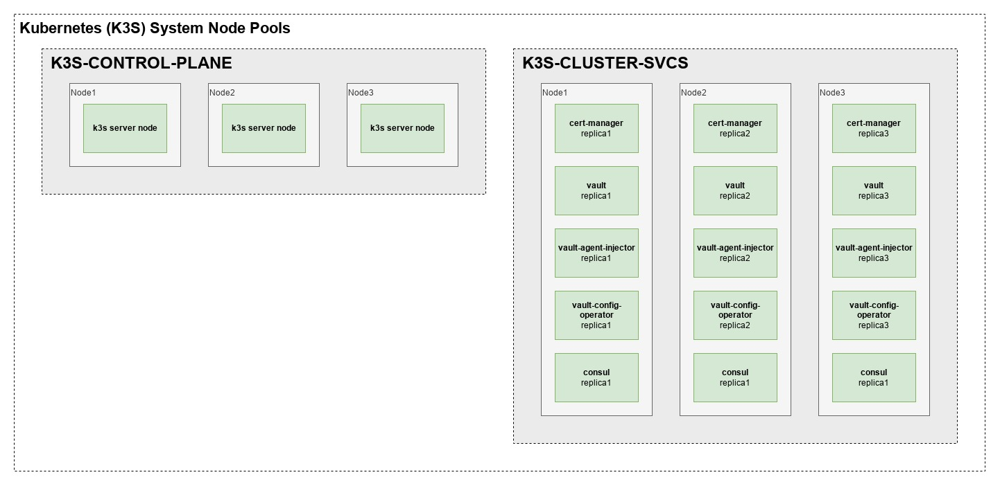
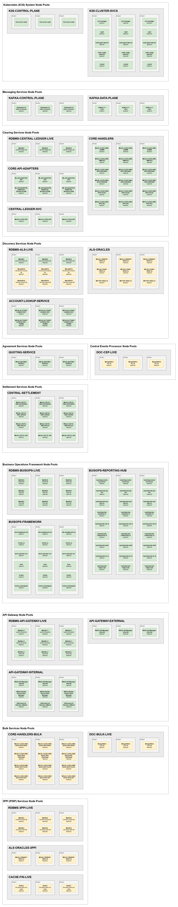

# Mojaloop Software Deployment Recommendations for on-premises deployments.

Supporting Mojaloop v15.x

**DRAFT VERSION SUBJECT TO REVIEW**

**Author:** James Bush &lt;[jbush@mojaloop.io](mailto:jbush@mojaloop.io)>

**Version:** draft

**Date:** 7th June 2023

# Introduction

The Mojaloop software is deployed as a set of containerized microservices. The microservices communicate via an mTLS secured intra-network. The container orchestration solution Mojaloop uses for production and that is in active use in all Mojaloop deployments is Kubernetes (see [https://kubernetes.io/](https://kubernetes.io/) for background information). The use of containers provides all the benefits of hardware virtualization without the overhead of multiple copies of the base operating system taking up memory and other system resources (see the literature on containers e.g. [https://opensource.com/resources/what-are-linux-containers](https://opensource.com/resources/what-are-linux-containers) for background information). Kubernetes provides a self-healing, high-availability environment that supports zero-downtime updating of software images and zero-downtime up-and-down-scaling of resources.

This document explores how to host Mojaloop using Kubernetes on top of bare-metal hosts and how the mojaloop software services may be deployed to give the best possible operational characteristics. Alternative patterns are given where possible.

Note that the recommendations in this document assume no use of external managed services such as RDBMS or Apache Kafka and make recommendations for deployments which include these components “in-cluster”.

Where recommendations for minimums are made in this document they generally represent the minimum acceptable configuration for attempting to provide high levels of service availability and resistance to data loss caused by system component failures.

# Additional Caveats

System throughput and performance in general depends on many factors and any estimates given in this document are for illustration purposes only and no guarantee of performance levels should be inferred from this document.

Please note that system procurement, installation, commissioning and maintenance of both hardware and software is the responsibility of the adopter and all due-diligence measures should be taken by them to ensure a suitable environment is created and maintained i.e. compliance with all required best practices, standards and regulations as may be required.

The recommendations in this document may be applicable to production and production-like environments, but such environments require a high level of design, installation and operational rigour not specified herein. It is recommended that expert services be employed by adopters to ensure compliance with best practice for availability, reliability, data management and protection, safety, security, regulatory compliance etc…

While we believe the recommendations in this document are complete, there are unknowns that we simply cannot account for. These recommendations should be viewed as a solid starting point for iteration.

The Mojaloop software evolves constantly and variations in performance, scalability, resilience and other functional characteristics should be expected over Mojaloop version increments.

# Purpose

The recommendations in this document are intended to inform the deployment configuration of Mojaloop services within a kubernetes hosting environment which attempts to:

1. Be flexible in terms of performance and operational characteristics (including transactional throughput, workload segregation and resilience to failures) with respect to cost of procurement, maintenance and operation.
2. Illustrate the use of Kubernetes constructs to run Mojaloop services on the most appropriate compute nodes of a Kubernetes cluster to give various operational characteristics such as throughput and resilience to failure.

Please see Appendix A for more information on Mojaloop software deployment architecture.

# Mojaloop Service Characteristics

The services required to operate a Mojaloop based system can be categorised thus:

<table>
  <tr>
   <td><strong>Category</strong>
   </td>
   <td><strong>Sub-Category</strong>
   </td>
   <td><strong>Description</strong>
   </td>
   <td><strong>Characteristics / Notes</strong>
   </td>
  </tr>
  <tr>
   <td>Kubernetes Control Plane
   </td>
   <td>Cluster Management
   </td>
   <td>Distributed components which run on every node that collaborate to ensure the health of the cluster and orchestrate the application services.
   </td>
   <td>Mission critical. Highly sensitive to storage layer characteristics such as latency and I/O throughput. Sensitive to network latency and throughput. Critical need for data redundancy and fault-tolerance.
   </td>
  </tr>
  <tr>
   <td>Relational Data Storage
   </td>
   <td>Live financial transaction data
   </td>
   <td>Traditional relational database (RDBMS) services e.g. MySQL which hold application state and data for in-flight and recent financial transactions as well as transaction routing data.
   </td>
   <td>Mission critical. Highly sensitive to storage layer characteristics such as latency and I/O throughput. Sensitive to network latency and throughput. CPU intensive. Critical need for data redundancy and fault-tolerance. Highly sensitive. Operator access is likely to be regulated.
   </td>
  </tr>
  <tr>
   <td>Relational Data Storage
   </td>
   <td>Live non-financial transaction data
   </td>
   <td>Traditional relational database (RDBMS) services e.g. MySQL which hold current application state and data for support services such as identity and access management and platform configuration, amongst others.
   </td>
   <td>Mission critical. Highly sensitive to storage layer characteristics such as latency and I/O throughput. Sensitive to network latency and throughput. CPU intensive. Critical need for data redundancy and fault-tolerance. Highly sensitive. Operator access is likely to be regulated.
   </td>
  </tr>
  <tr>
   <td>Relational Data Storage
   </td>
   <td>Archived financial transaction data
   </td>
   <td>Traditional relational database (RDBMS) services e.g. MySQL which hold application state and data for historical financial transactions.
   </td>
   <td>Mission critical. Critical need for data redundancy and fault-tolerance. Less of a performance concern for archived data as access patterns are typically less intensive. Highly sensitive. Operator access is likely to be regulated.
   </td>
  </tr>
  <tr>
   <td>Relational Data Storage
   </td>
   <td>Archived non-financial transaction data
   </td>
   <td>Traditional relational database (RDBMS) services e.g. MySQL which hold historical application state and data for support services such as transaction routing, identity and access management and platform configuration, amongst others.
   </td>
   <td>Mission critical. Critical need for data redundancy and fault-tolerance. Less of a performance concern for archived data as access patterns are typically less intensive. Highly sensitive. Operator access is likely to be regulated.
   </td>
  </tr>
  <tr>
   <td>Document Data Storage
   </td>
   <td>Live financial transaction data
   </td>
   <td>Document oriented databases e.g. MongoDB which hold current application state and data for in-flight and recent financial transactions e.g. bulk transfer data and business operations framework services.
   </td>
   <td>Mission critical. Highly sensitive to storage layer characteristics such as latency and I/O throughput. Sensitive to network latency and throughput. CPU intensive. Critical need for data redundancy and fault-tolerance. Highly sensitive. Operator access is likely to be regulated.
   </td>
  </tr>
  <tr>
   <td>Document Data Storage
   </td>
   <td>Archived financial transaction data
   </td>
   <td>Document oriented databases e.g. MongoDB which hold historical application state and data for historical financial transactions, i.e. bulk transfer data and business operations framework services.
   </td>
   <td>Mission critical. Critical need for data redundancy and fault-tolerance. Less of a performance concern for archived data as access patterns are typically less intensive. Highly sensitive. Operator access is likely to be regulated.
   </td>
  </tr>
  <tr>
   <td>Data Cache
   </td>
   <td>Live Financial and Non-financial Transaction Data
   </td>
   <td>In-memory and disk backed data cache services supporting third party payment initiation components and business operations framework.
   </td>
   <td>Mission critical if some mojaloop features are used (e.g. PISP/3PPI). Highly sensitive to storage layer characteristics such as latency and I/O throughput. Highly sensitive to network latency and throughput. CPU intensive under some circumstances. Critical need for data redundancy and fault-tolerance. Highly sensitive. Operator access is likely to be regulated.
   </td>
  </tr>
  <tr>
   <td>Inter-Service Messaging
   </td>
   <td>Control Plane
   </td>
   <td>Zookeeper components of the Apache Kafka cluster. Zookeeper is a highly reliable, distributed coordination service. It is used by Apache Kafka, Mojaloop’s messaging layer, to store metadata and state relating to consensus protocols.
   </td>
   <td>Mission critical. Highly sensitive to storage layer characteristics such as latency and I/O throughput. Highly sensitive to network latency and throughput. CPU intensive under some circumstances. Critical need for data redundancy and fault-tolerance.
   </td>
  </tr>
  <tr>
   <td>Inter-Service Messaging
   </td>
   <td>Data Plane
   </td>
   <td>Stream broker components of the Apache Kafka cluster. Kafka brokers serve reads and writes to message streams used by the core Mojaloop transfer processing / clearing pipelines.
   </td>
   <td>Mission critical. Highly sensitive to storage layer characteristics such as latency and I/O throughput. Highly sensitive to network latency and throughput. CPU intensive. Critical need for data redundancy and fault-tolerance. Highly sensitive. Operator access is likely to be regulated.
   </td>
  </tr>
  <tr>
   <td>Mojaloop Core Services
   </td>
   <td>API Adapters
   </td>
   <td>External facing interface services e.g. incoming and outgoing FSPIOP API for scheme participants.
   </td>
   <td>Mission critical. CPU and network intensive. Sensitive to network latency and throughput.
   </td>
  </tr>
  <tr>
   <td>Mojaloop Core Services
   </td>
   <td>Core Handlers
   </td>
   <td>Mojaloop core transfer processing pipeline components e.g. prepare, position, and fulfil handlers.
   </td>
   <td>Mission critical. CPU and network intensive. Sensitive to network latency and throughput.
   </td>
  </tr>
  <tr>
   <td>Mojaloop Core Services
   </td>
   <td>FSPIOP API Services
   </td>
   <td>Participant lookup services e.g. ALS and scheme hosted address resolution services (oracles), quotes service.
   </td>
   <td>Mission critical. CPU and network intensive. Sensitive to network latency and throughput.
   </td>
  </tr>
  <tr>
   <td>Peripheral Services
   </td>
   <td>API Gateway
   </td>
   <td>Services and components of API gateway (WSO2 by default).
   </td>
   <td>Mission critical. CPU and network intensive. Sensitive to network latency and throughput.
   </td>
  </tr>
  <tr>
   <td>Peripheral Services
   </td>
   <td>Business and Technical Operations
   </td>
   <td>Services for operating the Mojaloop switch from a business perspective, e.g. for enabling back office support, running settlement operations etc…
   </td>
   <td>Mission critical. CPU and network intensive. Sensitive to network latency and throughput.
   </td>
  </tr>
  <tr>
   <td>Peripheral Services
   </td>
   <td>Monitoring and diagnostics
   </td>
   <td>Services which support the technical monitoring of the Mojaloop software and fault diagnostics e.g. log analysis and technical service metrics etc…
   </td>
   <td>Mission critical. Highly sensitive to storage layer characteristics such as latency and I/O throughput. Sensitive to network latency and throughput. CPU intensive. Critical need for data redundancy and fault-tolerance. Highly sensitive. Operator access is likely to be regulated.
   </td>
  </tr>
</table>

# Kubernetes Recommendations

## Nodes

We recommend that Kairos ([https://kairos.io/](https://kairos.io/)) be used to create and maintain immutable operating system images for each host used as a Kubernetes node (control plane and worker pool nodes) in this deployment. Mojaloop utilises Alpine Linux as its container operating system, it is recommended by Kairos and is based on the Ubuntu kernel.

Nodes should be configured to boot to the Kairos image (kairos-alpine-ubuntu:v2.0.3-k3sv1.21.14-k3s1) using PXE network boot. See [https://kairos.io/docs/installation/netboot/](https://kairos.io/docs/installation/netboot/) for information on configuring a Kairos network boot service ([https://kairos.io/docs/reference/auroraboot/](https://kairos.io/docs/reference/auroraboot/)).

Kairos guidelines for installing a multi-node K3S cluster with a high availability control plane should be followed. See [https://kairos.io/docs/examples/ha/](https://kairos.io/docs/examples/ha/) for details of the configuration for both server (control plane) and worker nodes.

## Storage Layer

To provide the best operational characteristics of the storage layer, it is recommended to use physical node disks (as opposed to SAN or network attached storage devices) and to utilise them via the “local” kubernetes volume type. See [https://kubernetes.io/docs/concepts/storage/volumes/#local](https://kubernetes.io/docs/concepts/storage/volumes/#local) for more information. This applies particularly to services which are sensitive to disk latency and physical access patterns such as the Kubernetes control plane, Kafka and RDBMS services.

Note that it is recommended to follow best practice with respect to the use of RAID configurations. Use of RAID on physical disks provides additional safeguards against data loss and system downtime. _Close attention should be given to matching disk I/O sensitivities of the Mojaloop services to performance penalties imposed by the various RAID options._

The status of RAID array members should be constantly monitored and a suitable carrier grade alarming platform should be utilised to ensure rapid replacement of any failed disk hardware.

# Recommendations for Node Pools

The node pools referred to in this document should comprise three or more hosts, each dedicated to serving the pool. When increased system throughput or resistance to failures is desired, node pool size may be incremented in steps of two to ensure an odd number of nodes at all times.

Node pool member nodes should be configured as K3S agents. See [https://kairos.io/docs/examples/ha/#joining-a-worker](https://kairos.io/docs/examples/ha/#joining-a-worker) for more information on worker configuration.

_Although adding a node to an odd-sized cluster appears better since there are more machines, the fault tolerance is worse since exactly the same number of nodes may fail without losing quorum but there are more nodes that can fail. See [https://docs.k3s.io/datastore/ha-embedded](https://docs.k3s.io/datastore/ha-embedded) for more information._

# Recommendations for Kubernetes Control Plane and Cluster Services

It is recommended to run a separate K3S control plane node pool for core k3s cluster state and management services and a separate node pool for other cluster services.

See [https://kairos.io/docs/examples/ha/](https://kairos.io/docs/examples/ha/) for more information on deploying a high-availability K3S control plane.

# General Recommendations for Mojaloop Container Deployment

The following sections give minimum deployment recommendations for service categories and node pools that require special configuration to guard against data loss upon system failures. Suggestions are also made as to how to increase throughput, performance and redundancy for more business critical deployments.

## Relational Data Storage Containers (Live financial and non-financial transaction data)

_Note that the Mojaloop core services utilise MySQL version 8.0+, which supports “group replication”. However, the default WSO2 API gateway and IAM stack utilises MySQL version 5.7, which supports a less advanced replication model._

Each MySQL v8+ RDBMS service should be deployed in a minimum three node “group replication” cluster. Replicas should be deployed to different physical nodes to reduce the probability of any single physical hardware failure causing data loss and/or significant system downtime. See [https://dev.mysql.com/doc/refman/8.0/en/group-replication-summary.html](https://dev.mysql.com/doc/refman/8.0/en/group-replication-summary.html) and related pages for more information on MySQL Group Replication.

Each MySQL v5.7 RDBMS service supporting live non-financial data should be deployed in a minimum three node replication cluster with one node configured as primary and two nodes configured as secondary replicas. Replicas should be deployed to different physical nodes to reduce the probability of any single physical hardware failure causing data loss and/or significant system downtime. See [https://dev.mysql.com/doc/refman/5.7/en/replication-solutions-switch.html](https://dev.mysql.com/doc/refman/5.7/en/replication-solutions-switch.html) and related pages for more information on MySQL v5.7 replication and failure recovery scenarios.

Replicas should be deployed to nodes that are expected to fail independently i.e. in separate physical racks, powered by separate diverse power supplies and connected via separate network switching components.

Note that additional members may be added to the replication groups to increase redundancy and overall transactional throughput (in some circumstances - see MySQL docs on replication groups for more information). Any additional members should be deployed to additional different physical nodes in order to maintain resilience against physical hardware failures.

_Note: The Mojaloop Foundation recommends that expert DBA services be engaged to configure, test and maintain RDBMS replicas in business critical Mojaloop deployments._

## Relational Data Storage Containers (Archived financial and non-financial transaction data)

_Note that over time, Mojaloop systems may accumulate a large volume of data in their RDBMS stores. It is expected that data older than a certain period, typically determined by system throughput, available storage capacity and operator preferences, be kept in archive for a further period of time, typically defined by operator and/or regulatory policies for record keeping, before being destroyed. The requirements for guarding against data loss of archived data may be less strict than those for more recent periods of activity and the following recommendations may be relaxed to less stringent levels in order to reduce the cost implication of maintaining the same level of redundancy and availability as for current data. Such relaxation should however be undertaken with due care for applicable regulations and best practice operating procedures for data backup and disaster recovery._

**_Note that the set of node pools described elsewhere in this document does not make provision for archive data storage. Provision for archiving data externally to the operational clusters should be made and best practice processes should be employed for handling of such archives such as to guard against loss, theft or misuse of said data. Where applicable, local legislation should be followed._**

Each MySQL 8+ RDBMS service supporting archived financial and non-financial data should be deployed in a minimum three node “group replication” cluster. Replicas should be deployed to different physical nodes to reduce the probability of any single physical hardware failure causing data loss and/or system downtime. See [https://dev.mysql.com/doc/refman/8.0/en/group-replication-summary.html](https://dev.mysql.com/doc/refman/8.0/en/group-replication-summary.html) and related pages for more information on MySQL Group Replication.

Each MySQL v5.7 RDBMS service supporting archived non-financial data should be deployed in a minimum three node replication cluster with one node configured as primary and two nodes configured as secondary replicas. Replicas should be deployed to different physical nodes to reduce the probability of any single physical hardware failure causing data loss and/or significant system downtime. See [https://dev.mysql.com/doc/refman/5.7/en/replication-solutions-switch.html](https://dev.mysql.com/doc/refman/5.7/en/replication-solutions-switch.html) and related pages for more information on MySQL v5.7 replication and failure recovery scenarios.

Replicas should be deployed to nodes that are expected to fail independently i.e. in separate physical racks, powered by separate diverse power supplies and connected via separate network switching components.

Note that additional members may be added to the replication groups to increase redundancy and overall transactional throughput (in some circumstances). Any additional members should be deployed to additional different physical nodes in order to maintain resilience against physical hardware failures.

_Note: The Mojaloop Foundation recommends that expert DBA services be engaged to configure, test and maintain RDBMS replicas in business critical Mojaloop deployments._

## Document Data Storage Containers (Live financial transaction data)

Each MongoDB service supporting live financial data should be deployed in a minimum three node replica set. Replicas should be deployed to different physical nodes to reduce the probability of any single physical hardware failure causing data loss and/or significant system downtime. See [https://www.mongodb.com/docs/manual/replication/](https://www.mongodb.com/docs/manual/replication/) and related pages for more information on MongoDB replication.

Replicas should be deployed to nodes that are expected to fail independently i.e. in separate physical racks, powered by separate diverse power supplies and connected via separate network switching components.

Note that additional members may be added to the replica sets to increase redundancy. Any additional members should be deployed to additional different physical nodes in order to maintain resilience against physical hardware failures.

_Note: The Mojaloop Foundation recommends that expert DBA services be engaged to configure, test and maintain MongoDB replicas in business critical Mojaloop deployments._

## Document Data Storage Containers (Archived financial transaction data)

Each MongoDB service supporting archived financial data should be deployed in a minimum three node replica set. Replicas should be deployed to different physical nodes to reduce the probability of any single physical hardware failure causing data loss and/or significant system downtime. See [https://www.mongodb.com/docs/manual/replication/](https://www.mongodb.com/docs/manual/replication/) and related pages for more information on MongoDB replication.

Replicas should be deployed to nodes that are expected to fail independently i.e. in separate physical racks, powered by separate diverse power supplies and connected via separate network switching components.

Note that additional members may be added to the replica sets to increase redundancy. Any additional members should be deployed to additional different physical nodes in order to maintain resilience against physical hardware failures.

_Note: The Mojaloop Foundation recommends that expert DBA services be engaged to configure, test and maintain MongoDB replicas in business critical Mojaloop deployments._

## Data Cache Containers (Live Financial and Non-financial Transaction Data)

Each Redis service supporting live financial and non-financial data should be deployed in a minimum three node replica set. Replicas should be deployed to different physical nodes to reduce the probability of any single physical hardware failure causing data loss and/or significant system downtime. See [https://redis.io/docs/management/replication/](https://redis.io/docs/management/replication/) and related pages for more information on Redis replication. Note that Redis persistence should be turned on, on both primary and secondaries, to further guard against data loss caused by hardware failure.

Replicas should be deployed to nodes that are expected to fail independently i.e. in separate physical racks, powered by separate diverse power supplies and connected via separate network switching components.

Note that additional members may be added to the replica sets to increase redundancy. Any additional members should be deployed to additional different physical nodes in order to maintain resilience against physical hardware failures.

_Note: The Mojaloop Foundation recommends that expert DBA services be engaged to configure, test and maintain Redis replicas in business critical Mojaloop deployments._

## Inter-Service Messaging Containers (Control Plane)

Each Apache Zookeeper service supporting inter-service message stream services (Apache Kafka) should be deployed in a minimum three node ensemble. Members should be deployed to different physical nodes to reduce the probability of any single physical hardware failure causing data loss and/or significant system downtime. See [https://docs.confluent.io/platform/current/kafka-metadata/zk-production.html#multi-node-setup](https://docs.confluent.io/platform/current/kafka-metadata/zk-production.html#multi-node-setup) and related pages for more information on Zookeeper production deployment.

Members should be deployed to nodes that are expected to fail independently i.e. in separate physical racks, powered by separate diverse power supplies and connected via separate network switching components.

Note that additional members may be added to the ensemble to increase redundancy. Any additional members should be deployed to additional different physical nodes in order to maintain resilience against physical hardware failures.

_Note: The Mojaloop Foundation recommends that expert Apache Kafka services be engaged to configure, test and maintain Apache Zookeeper in business critical Mojaloop deployments._

## Inter-Service Messaging Containers (Data Plane)

Each Apache Kafka broker supporting inter-service message stream services should be deployed in a minimum three node cluster. Members should be deployed to different physical nodes to reduce the probability of any single physical hardware failure causing data loss and/or significant system downtime. See [https://docs.confluent.io/platform/current/kafka/deployment.html](https://docs.confluent.io/platform/current/kafka/deployment.html#) and related pages for more information on Kafka production deployment. Note that the Kafka replication factor should be set to 3 for a 3 node cluster and potentially higher for larger clusters to increase resilience against one or more node failures.

Cluster members should be deployed to nodes that are expected to fail independently i.e. in separate physical racks, powered by separate diverse power supplies and connected via separate network switching components.

Note that additional members may be added to the cluster to increase redundancy and throughput capacity (in certain circumstances). Any additional members should be deployed to additional different physical nodes in order to maintain resilience against physical hardware failures.

_Note: The Mojaloop Foundation recommends that expert Apache Kafka services be engaged to configure, test and maintain Apache Kafka in business critical Mojaloop deployments._

# General Recommendations for Mojaloop Kubernetes Node Pool Configuration

The following table gives idealised recommendations for creating pools of kubernetes worker nodes to achieve maximum separation of concerns between services from a functional perspective. This arrangement is intended to limit the negative functional impact of any single node pool worker failure, minimising overall service degradation and to maximise preemptive reservation of RAM, CPU and disk for each workload.

This arrangement does not necessarily represent a general minimum deployment requirement but serves as a reference for reasoning about desirable separation of service elements via worker isolation. It should be noted, when considering actual deployment patterns, that the mojaloop services have differing work cycles and certain of the contained pods/services will typically spend an amount of time idle, or close to idle during normal operational duty. This gives a level of flexibility and combining less critical workloads is typically desirable to achieve efficient use of available physical resources. See the following section on node pool definitions for further recommendations.

Recommendations are included in the table for high-level node specifications; these are guidelines and may need to be increased or decreased to suit the deployment once performance and load testing on the specific hardware platform has been performed. _Note that no clock frequency or silicon architecture is specified for CPU cores. As a general rule, mid to high level enterprise server quality CPUs should be utilised to provide the best operational characteristics._

Each pod/service should be replicated one instance per worker node. See the other sections in this document for guidance on clustering of specific service types.

<table>
  <tr>
   <td>Node Pool Name
   </td>
   <td>
   </td>
   <td>Node Count
   </td>
   <td>CPU Cores Per Node
   </td>
   <td>RAM Per Node
   </td>
   <td>HDD Space & IOPS Per Node
   </td>
   <td>Pods / Services
   </td>
   <td>Notes / Comments
   </td>
  </tr>
  <tr>
   <td>K3S-CONTROL-PLANE
   </td>
   <td>Initial
   </td>
   <td>3
   </td>
   <td>4
   </td>
   <td>8GB
   </td>
   <td>128GB dedicated
   </td>
   <td>K3S server node components.
   </td>
   <td>This is sufficient for 100 Kubernetes worker nodes and cannot be smaller. See <a href="https://docs.k3s.io/installation/requirements#cpu-and-memory">https://docs.k3s.io/installation/requirements#cpu-and-memory</a> and <a href="https://etcd.io/docs/v3.5/op-guide/hardware/">https://etcd.io/docs/v3.5/op-guide/hardware/</a>
   </td>
  </tr>
  <tr>
   <td rowspan="2" >K3S-CLUSTER-SVCS
   </td>
   <td>Initial
   </td>
   <td>3
   </td>
   <td>4
   </td>
   <td>32GB
   </td>
   <td>128GB
   </td>
   <td rowspan="2" >cert-manager, vault, vault-agent-injector, vault-config-operator, consul
   </td>
   <td rowspan="2" >
   </td>
  </tr>
  <tr>
   <td>Upgrade
   </td>
   <td>3+
   </td>
   <td>8
   </td>
   <td>64GB
   </td>
   <td>128GB
   </td>
  </tr>
  <tr>
   <td rowspan="2" >KAFKA-CONTROL-PLANE
   </td>
   <td>Initial
   </td>
   <td>3
   </td>
   <td>4
   </td>
   <td>32GB
   </td>
   <td>128GB
   </td>
   <td rowspan="2" >kafka-zookeeper
   </td>
   <td rowspan="2" >
   </td>
  </tr>
  <tr>
   <td>Upgrade
   </td>
   <td>3+
   </td>
   <td>8
   </td>
   <td>64GB
   </td>
   <td>128GB
   </td>
  </tr>
  <tr>
   <td rowspan="2" >KAFKA-DATA-PLANE
   </td>
   <td>Initial
   </td>
   <td>3
   </td>
   <td>4
   </td>
   <td>32GB
   </td>
   <td>500GB
   </td>
   <td rowspan="2" >kafka
   </td>
   <td rowspan="2" >
   </td>
  </tr>
  <tr>
   <td>Upgrade
   </td>
   <td>3+
   </td>
   <td>16
   </td>
   <td>64GB
   </td>
   <td>500GB
   </td>
  </tr>
  <tr>
   <td rowspan="2" >RDBMS-CENTRAL-LEDGER-LIVE
   </td>
   <td>Initial
   </td>
   <td>3
   </td>
   <td>4
   </td>
   <td>32GB
   </td>
   <td>500GB
   </td>
   <td rowspan="2" >central-ledger-db
   </td>
   <td rowspan="2" >
   </td>
  </tr>
  <tr>
   <td>Upgrade
   </td>
   <td>3+
   </td>
   <td>16+
   </td>
   <td>64GB+
   </td>
   <td>500GB+
   </td>
  </tr>
  <tr>
   <td rowspan="2" >CORE-API-ADAPTERS
   </td>
   <td>Initial
   </td>
   <td>3
   </td>
   <td>4
   </td>
   <td>32GB
   </td>
   <td>128GB
   </td>
   <td rowspan="2" >ml-api-adapter, ml-api-adapter-handler-notification
   </td>
   <td rowspan="2" >
   </td>
  </tr>
  <tr>
   <td>Upgrade
   </td>
   <td>3+
   </td>
   <td>8+
   </td>
   <td>64GB
   </td>
   <td>128GB
   </td>
  </tr>
  <tr>
   <td rowspan="2" >CENTRAL-LEDGER-SVC
   </td>
   <td>Initial
   </td>
   <td>3
   </td>
   <td>4
   </td>
   <td>32GB
   </td>
   <td>128GB
   </td>
   <td rowspan="2" >central-ledger-service
   </td>
   <td rowspan="2" >
   </td>
  </tr>
  <tr>
   <td>Upgrade
   </td>
   <td>3+
   </td>
   <td>8+
   </td>
   <td>64GB
   </td>
   <td>128GB
   </td>
  </tr>
  <tr>
   <td rowspan="2" >CORE-HANDLERS
   </td>
   <td>Initial
   </td>
   <td>3
   </td>
   <td>4
   </td>
   <td>32GB
   </td>
   <td>128GB
   </td>
   <td rowspan="2" >central-ledger-handler-admin, central-ledger-handler-timeout, central-ledger-handler-prepare, central-ledger-handler-position, central-ledger-handler-fulfil, central-ledger-handler-get 
   </td>
   <td rowspan="2" >
   </td>
  </tr>
  <tr>
   <td>Upgrade
   </td>
   <td>3+
   </td>
   <td>16+
   </td>
   <td>64GB
   </td>
   <td>128GB
   </td>
  </tr>
  <tr>
   <td rowspan="2" >RDBMS-ALS-LIVE
   </td>
   <td>Initial
   </td>
   <td>3
   </td>
   <td>4
   </td>
   <td>32GB
   </td>
   <td>500GB
   </td>
   <td rowspan="2" >account-lookup-db, mfi-account-oracle-db, mfi-p2p-oracle-db
   </td>
   <td rowspan="2" >
   </td>
  </tr>
  <tr>
   <td>Upgrade
   </td>
   <td>3+
   </td>
   <td>16+
   </td>
   <td>64GB+
   </td>
   <td>500GB+
   </td>
  </tr>
  <tr>
   <td rowspan="2" >ALS-ORACLES
   </td>
   <td>Initial
   </td>
   <td>3
   </td>
   <td>4
   </td>
   <td>32GB
   </td>
   <td>128GB
   </td>
   <td rowspan="2" >moja-consent-oracle, mfi-account-oracle, mfi-p2p-oracle
   </td>
   <td rowspan="2" >
   </td>
  </tr>
  <tr>
   <td>Upgrade
   </td>
   <td>3+
   </td>
   <td>8+
   </td>
   <td>64GB+
   </td>
   <td>128GB
   </td>
  </tr>
  <tr>
   <td rowspan="2" >ACCOUNT-LOOKUP-SERVICE
   </td>
   <td>Initial
   </td>
   <td>3
   </td>
   <td>4
   </td>
   <td>32GB
   </td>
   <td>128GB
   </td>
   <td rowspan="2" >account-lookup-service, account-lookup-service-admin
   </td>
   <td rowspan="2" >
   </td>
  </tr>
  <tr>
   <td>Upgrade
   </td>
   <td>3+
   </td>
   <td>8+
   </td>
   <td>64GB+
   </td>
   <td>128GB
   </td>
  </tr>
  <tr>
   <td rowspan="2" >QUOTING-SERVICE
   </td>
   <td>Initial
   </td>
   <td>3
   </td>
   <td>4
   </td>
   <td>32GB
   </td>
   <td>128GB
   </td>
   <td rowspan="2" >moja-quoting-service
   </td>
   <td rowspan="2" >
   </td>
  </tr>
  <tr>
   <td>Upgrade
   </td>
   <td>3+
   </td>
   <td>8+
   </td>
   <td>64GB+
   </td>
   <td>128GB
   </td>
  </tr>
  <tr>
   <td rowspan="2" >CENTRAL-SETTLEMENT
   </td>
   <td>Initial
   </td>
   <td>3
   </td>
   <td>4
   </td>
   <td>32GB
   </td>
   <td>128GB
   </td>
   <td rowspan="2" >moja-centralsettlement-handler-deferred, moja-centralsettlement-handler-gross, moja-centralsettlement-handler-rules, 

moja-centralsettlement-service
   </td>
   <td rowspan="2" >
   </td>
  </tr>
  <tr>
   <td>Upgrade
   </td>
   <td>3+
   </td>
   <td>8+
   </td>
   <td>64GB+
   </td>
   <td>128GB
   </td>
  </tr>
  <tr>
   <td rowspan="2" >DOC-CEP-LIVE
   </td>
   <td>Initial
   </td>
   <td>3
   </td>
   <td>4
   </td>
   <td>32GB
   </td>
   <td>128GB
   </td>
   <td rowspan="2" >cep-db
   </td>
   <td rowspan="2" >
   </td>
  </tr>
  <tr>
   <td>Upgrade
   </td>
   <td>3+
   </td>
   <td>8+
   </td>
   <td>64GB+
   </td>
   <td>128GB
   </td>
  </tr>
  <tr>
   <td rowspan="2" >RDBMS-BUISOPS-LIVE
   </td>
   <td>Initial
   </td>
   <td>3
   </td>
   <td>4
   </td>
   <td>32GB
   </td>
   <td>500GB
   </td>
   <td rowspan="2" >kratos-db, keto-db, mcm-db
   </td>
   <td rowspan="2" >
   </td>
  </tr>
  <tr>
   <td>Upgrade
   </td>
   <td>3+
   </td>
   <td>16+
   </td>
   <td>64GB+
   </td>
   <td>500GB+
   </td>
  </tr>
  <tr>
   <td rowspan="2" >BUISOPS-REPORTING-HUB
   </td>
   <td>Initial
   </td>
   <td>3
   </td>
   <td>4
   </td>
   <td>32GB
   </td>
   <td>128GB
   </td>
   <td rowspan="2" >reporting-events-processor, reporting-hub-api-svc, reporting-hub-exp-api-svc, reporting-hub-positions-ui, reporting-hub-role-ui, reporting-hub-settlements-ui, reporting-hub-shell, reporting-hub-trx-ui, reporting-hub-legacy-api
   </td>
   <td rowspan="2" >
   </td>
  </tr>
  <tr>
   <td>Upgrade
   </td>
   <td>3+
   </td>
   <td>8+
   </td>
   <td>64GB+
   </td>
   <td>128GB
   </td>
  </tr>
  <tr>
   <td rowspan="2" >BUISOPS-FRAMEWORK
   </td>
   <td>Initial
   </td>
   <td>3
   </td>
   <td>4
   </td>
   <td>32GB
   </td>
   <td>128GB
   </td>
   <td rowspan="2" >role-assignment-svc, kratos-ui, perm-operator-svc, keto, kratos, kratos-automigrate
   </td>
   <td rowspan="2" >
   </td>
  </tr>
  <tr>
   <td>Upgrade
   </td>
   <td>3+
   </td>
   <td>8+
   </td>
   <td>64GB+
   </td>
   <td>128GB
   </td>
  </tr>
  <tr>
   <td rowspan="2" >RDBMS-3PPI-LIVE
   </td>
   <td>Initial
   </td>
   <td>3
   </td>
   <td>4
   </td>
   <td>32GB
   </td>
   <td>500GB
   </td>
   <td rowspan="2" >consent-oracle-db, 3rd-party-auth-db
   </td>
   <td rowspan="2" >
   </td>
  </tr>
  <tr>
   <td>Upgrade
   </td>
   <td>3+
   </td>
   <td>16+
   </td>
   <td>64GB+
   </td>
   <td>500GB+
   </td>
  </tr>
  <tr>
   <td rowspan="2" >ALS-ORACLES-3PPI
   </td>
   <td>Initial
   </td>
   <td>3
   </td>
   <td>4
   </td>
   <td>32GB
   </td>
   <td>128GB
   </td>
   <td rowspan="2" >moja-consent-oracle
   </td>
   <td rowspan="2" >
   </td>
  </tr>
  <tr>
   <td>Upgrade
   </td>
   <td>3+
   </td>
   <td>8+
   </td>
   <td>64GB+
   </td>
   <td>128GB
   </td>
  </tr>
  <tr>
   <td rowspan="2" >CACHE-FIN-LIVE
   </td>
   <td>Initial
   </td>
   <td>3
   </td>
   <td>4
   </td>
   <td>32GB
   </td>
   <td>128GB
   </td>
   <td rowspan="2" >3rd-party-auth-svc-redis
   </td>
   <td rowspan="2" >
   </td>
  </tr>
  <tr>
   <td>Upgrade
   </td>
   <td>3+
   </td>
   <td>8+
   </td>
   <td>64GB+
   </td>
   <td>128GB+
   </td>
  </tr>
  <tr>
   <td rowspan="2" >CORE-HANDLERS-BULK
   </td>
   <td>Initial
   </td>
   <td>3
   </td>
   <td>4
   </td>
   <td>32GB
   </td>
   <td>128GB
   </td>
   <td rowspan="2" >moja-cl-handler-bulk-transfer-fulfil, moja-cl-handler-bulk-transfer-get, moja-cl-handler-bulk-transfer-prepare, moja-cl-handler-bulk-transfer-processing
   </td>
   <td rowspan="2" >
   </td>
  </tr>
  <tr>
   <td>Upgrade
   </td>
   <td>3+
   </td>
   <td>16+
   </td>
   <td>64GB
   </td>
   <td>128GB
   </td>
  </tr>
  <tr>
   <td rowspan="2" >DOC-BULK-LIVE
   </td>
   <td>Initial
   </td>
   <td>3
   </td>
   <td>4
   </td>
   <td>32GB
   </td>
   <td>128GB
   </td>
   <td rowspan="2" >bulk-db
   </td>
   <td rowspan="2" >
   </td>
  </tr>
  <tr>
   <td>Upgrade
   </td>
   <td>3+
   </td>
   <td>16+
   </td>
   <td>128GB+
   </td>
   <td>250GB+
   </td>
  </tr>
  <tr>
   <td rowspan="2" >RDBMS-API-GATEWAY-LIVE
   </td>
   <td>Initial
   </td>
   <td>3
   </td>
   <td>4
   </td>
   <td>32GB
   </td>
   <td>128GB
   </td>
   <td rowspan="2" >Wso2-init-ext-dbm wso2-init-int-db, wso2-db
   </td>
   <td rowspan="2" >
   </td>
  </tr>
  <tr>
   <td>Upgrade
   </td>
   <td>3+
   </td>
   <td>16+
   </td>
   <td>64GB+
   </td>
   <td>128GB+
   </td>
  </tr>
  <tr>
   <td rowspan="2" >API-GATEWAY-INTERNAL
   </td>
   <td>Initial
   </td>
   <td>3
   </td>
   <td>4
   </td>
   <td>32GB
   </td>
   <td>128GB
   </td>
   <td rowspan="2" >wso2-am-int, wso2-iskm, haproxy-callback
   </td>
   <td rowspan="2" >
   </td>
  </tr>
  <tr>
   <td>Upgrade
   </td>
   <td>3+
   </td>
   <td>16+
   </td>
   <td>128GB+
   </td>
   <td>128GB+
   </td>
  </tr>
  <tr>
   <td rowspan="2" >API-GATEWAY-EXTERNAL
   </td>
   <td>Initial
   </td>
   <td>3
   </td>
   <td>4
   </td>
   <td>32GB
   </td>
   <td>128GB
   </td>
   <td rowspan="2" >wso2-am-ext
   </td>
   <td rowspan="2" >
   </td>
  </tr>
  <tr>
   <td>Upgrade
   </td>
   <td>3+
   </td>
   <td>16+
   </td>
   <td>128GB+
   </td>
   <td>128GB+
   </td>
  </tr>
</table>

## Combining Workloads

In order to make efficient use of available hardware resources, and given that not all the mojaloop software services are constantly working at maximum capacity, some of the workloads described may be combined and multiple sets of services deployed on a smaller overall set of nodes.

It should be noted that hardware utilisation i.e. CPU usage, RAM allocation, disk I/O and available space as well as network I/O, should be constantly monitored to look for hotspots in the cluster and appropriate action taken to reallocate work to other, less busy physical nodes.

Some workloads are critical to maintaining a generally healthy and performant cluster. These should not be merged in production-like environments.

1. In order to avoid merging business critical workloads, which must remain separate in a production deployment, we have defined the following node pools with workload affinities:

    K3S-CONTROL-PLANE, K3S-CLUSTER-SVCS, RDBMS-CENTRAL-LEDGER-LIVE, KAFKA-CONTROL-PLANE, KAFKA-DATA-PLANE, API-GATEWAY-INTERNAL, API-GATEWAY-EXTERNAL.

2. If the “bulk payments” Mojaloop features are being used frequently then the following node pool should also never be merged with others:

    DOC-FIN-LIVE.

3. If the “PISP” / Third party payment initiation (3PPI) Mojaloop features are being used frequently then the following node pool should also never be merged with others:

    CACHE-FIN-LIVE

Combining any of the workloads in a different combination is untested and in some cases will violate best practices and so risk degraded security, poor performance and “hard to recover from” scenarios developing during failure situations potentially leading to significant system downtime and complex recovery operations being required.

## Suggested Workload Combinations

Other workloads may be considered for combining in order to spread services as best as possible across physical nodes. It should be noted however, that combining too many services into a small number of worker nodes will have significant detrimental effects on system performance, throughput, reliability, security and ease of maintenance.

The following combined pools offer a reasonable degree of workload separation while minimising the overall number of physical nodes required. This may be appropriate as a starting point for a minimal deployment.

### Combined Pool 1

- QUOTING-SERVICE
- CORE-API-ADAPTERS

### Combined Pool 2

- ACCOUNT-LOOKUP-SERVICE
- ALS-ORACLES
- RDBMS-ALS-LIVE
- ALS-ORACLES-3PPI
- RDBMS-3PPI-LIVE

### Combined Pool 3

- CENTRAL-LEDGER-SVC
- CORE-HANDLERS
- CORE-HANDLERS-BULK

### Combined Pool 4

- DOC-CEP-LIVE
- CACHE-FIN-LIVE
- DOC-BULK-LIVE

# Disaster Recovery

Mojaloop software utilises distributed consensus algorithms and horizontal scale-out patterns to achieve a high degree of resilience against data loss and system downtime due to hardware failure. This typically negates the need for more traditional “backup” based disaster recovery strategies. However, it should be noted that it is highly desirable for production grade Mojaloop deployments to span multiple physically separated data centres, with node pool workers in multiple physical locations, served by multiple redundant power and network interconnects. With correct planning, which is beyond the scope of this document, it is possible to design a system which replicates all data and services across multiple locations, protecting against single site failure.

# Further Hardware Considerations

It should be noted that scale-up of the proposed platform is achievable through the addition of physical nodes. Such scale-up should ideally follow the Mojaloop architecture and additional system performance and enhanced durability characteristics may be achieved through the addition of numbers of low-cost commodity servers.

# Appendix A - High Availability Deployment Architecture Illustration

# Appendix B - Node Pools Pod/Service Mapping Illustration

